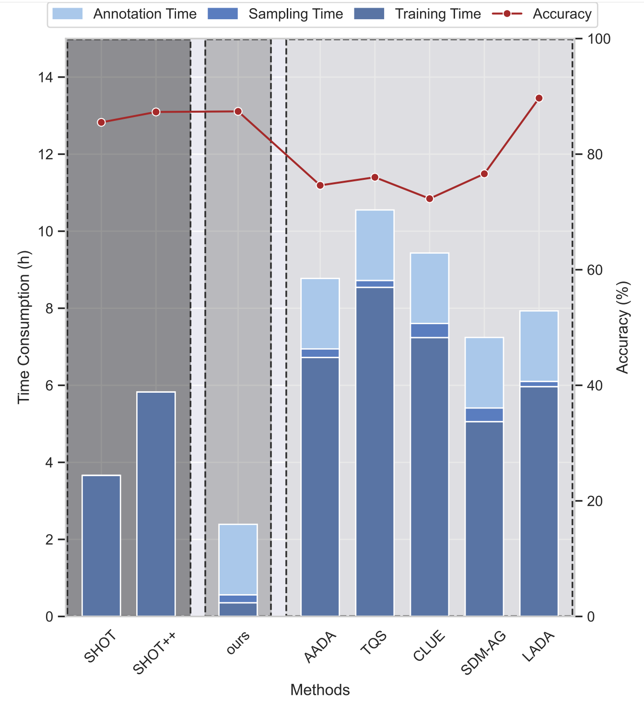

# Learn from the Learnt for SF-ADA (ECCV 2024)
### [[Paper](https://arxiv.org/abs/2407.18899)] <br>
 

<div align='center'>

</div>

## Introduction

This repo provides the official implementation of paper ``Learn from the Learnt: Source-Free Active Domain Adaptation via Contrastive Sampling and Visual Persistence``.

## Benchmarks

- [x] VisDA-C
- [x] office-home
- [x] office


## Usage

### Requirements
- `python=3.10`
- `torch=2.3.0`
- `torchvision`


### Dataset
Datasets are placed in `data/<dataset>/<domain>`. Then generate the filepath2label lists following [tim-learn/SHOT](https://github.com/tim-learn/SHOT).

### Training and Evaluation
Take the VISDA-C for example,
- Train the source model
```
python train_source.py \
    --dset VISDA-C  --net resnet101 --output ckps/source/ \
    --lr 1e-3 --max_epoch 10
# For reference, my source ckpt got 53.67% on the target domain before adaptation. 
```
- Iteratively query and train on the target domain
```
python adapt_target.py --dset VISDA-C --init_pool source \
    --source_dir ckps/source/uda/VISDA-C/T --seed {seed} \
    --lambda_topk 0.1 --cd_ratio 0.03 --topk 500 \
    --beta_vpa 10.0 --beta_im 0.9 --sfada_ubl 1 \
    --num_round 10 --max_epoch 10

# for the office dataset
python adapt_target.py --dset office --init_pool source \
    --s 0 --t 1 --seed {seed} \
    --lambda_topk 0.1 --cd_ratio 0.03 --topk 100 \
    --beta_vpa 1.0 --beta_im 0.9 \
    --num_round 10 --ratio_per_round 0.01 \
    --net resnet50 --max_epoch 15
```
The results reported in the paper were conducted with seeds [2023, 2024, 2025], with smaller datasets naturally exhibiting some variance.

## Acknowledgment

The codebase is based on the SF-DA work [tim-learn/SHOT](https://github.com/tim-learn/SHOT).

## Citation

```
@inproceedings{lftl2024,
    title={Learn from the learnt: source-free active domain adaptation via contrastive sampling and visual persistence},
    author={Lyu, Mengyao and Hao, Tianxiang and Xu, Xinhao and Chen, Hui and Lin, Zijia and Han, Jungong and Ding, Guiguang},
    booktitle={European Conference on Computer Vision},
    pages={228--246},
    year={2024},
    organization={Springer}
}
```